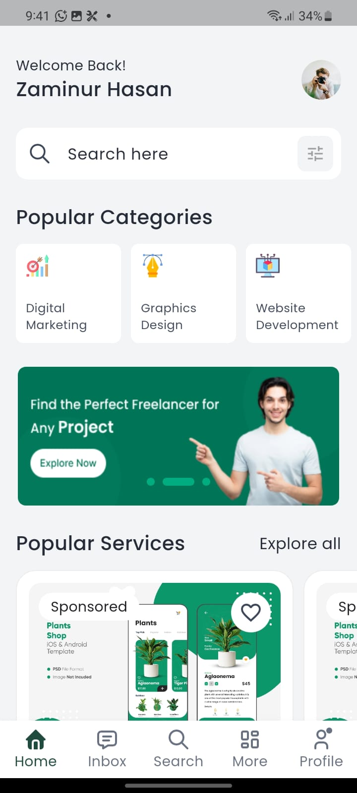
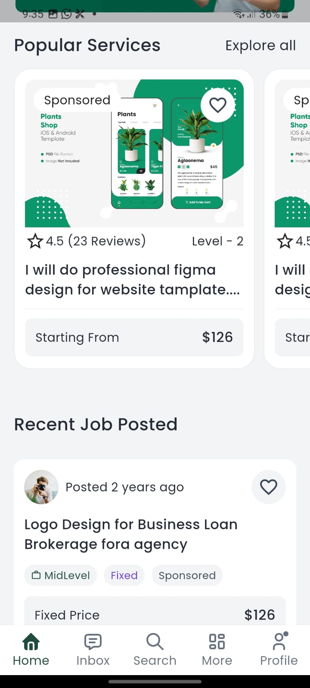
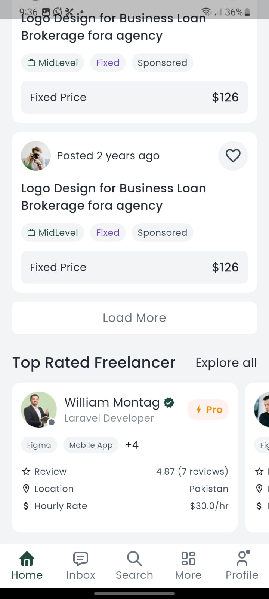

# Freelancer App

A Flutter-based mobile application that showcases top-rated freelancers, popular services, and categories. The app fetches data from a REST API and uses **Provider** for state management.

---

## What I have done

1. Figma to Flutter (Home screen)
2. RESTful API integration for Top Rated Freelancer
3. State Management: Provider
4. Base url: 'https://xilancer.xgenious.com/api/v1/'
5. EndPoint: 'freelancers/list?per_page=15'

---

## Screens

1. **Home Screen** – Displays user header, popular categories, carousel, popular services, job posts, and top freelancers.
2. **Search Screen** – Placeholder screen.
3. **Messages Screen** – Placeholder screen.
4. **Profile Screen** – Placeholder screen.
5. **About Screen** – Placeholder Screen.

---

## Setup Instructions

### Prerequisites

- Flutter SDK >= 3.25.4
- Dart SDK >= 3.9.2
- Android Studio or VS Code
- Internet connection (to fetch API data)

### Steps

1. **Clone the repository:**

```bash
git clone https://github.com/yourusername/freelancer_app.git
cd freelancer_app
```
---

## Screenshots

<p float="left">
  
  
  
</p>

## Demo Video

[![Watch Demo]](screenShoots/screen_video.mp4)


---

## Download

You can download the APK for Android devices here:

[Download APK]([downloads/freelancer_app.apk](https://github.com/Zaminur151/Freelancer-App/releases/download/v0.0.1/app-release.apk))

> For iOS, run the project in Xcode or simulator.

